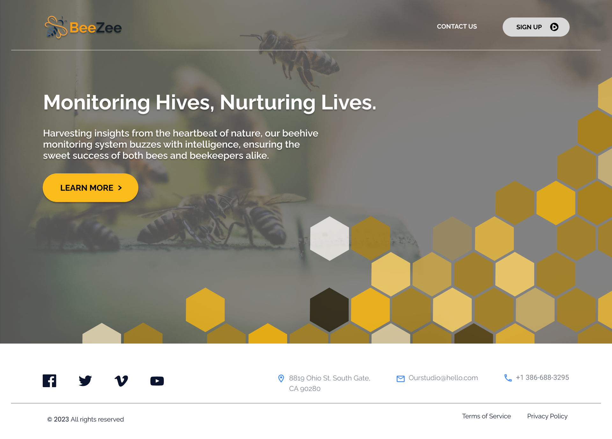
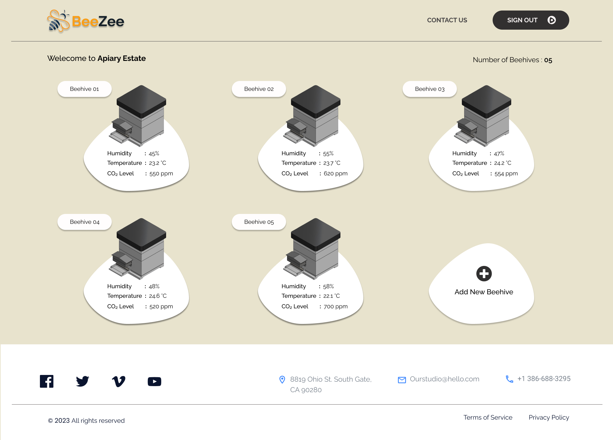
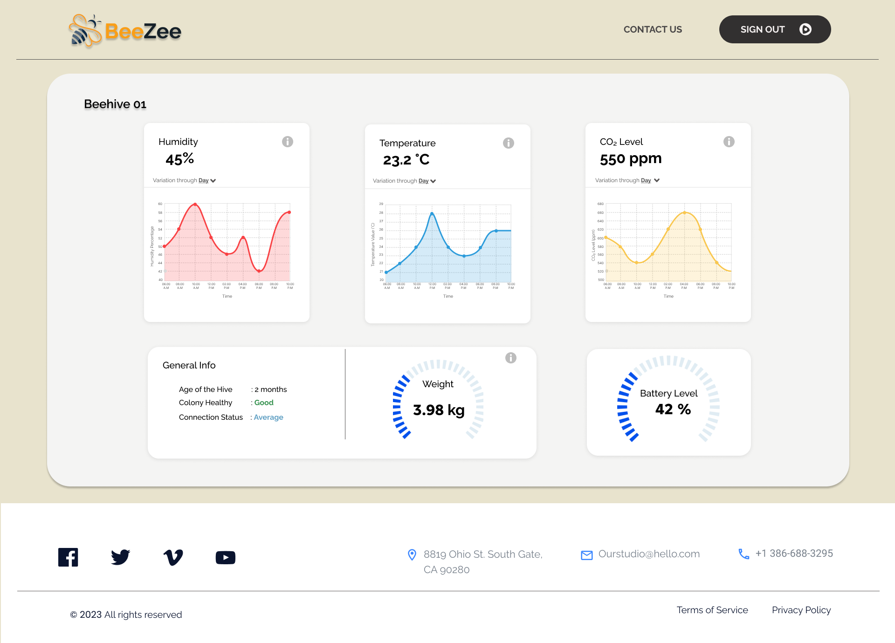

  
  <h1 style="display: inline-block; margin-left: 20px;">BeeZee | SMART BEEHIVE MONITORING SYSTEM</h1>
  <h3>🐝 Monitoring Hives, Nurturing Lives.</h3>

## Team
-  E/19/008, R.A.J.C. Adhikari, [email](mailto:e19008@eng.pdn.ac.lk)
-  E/19/009, A.M.K.M. Adikari, [email](mailto:e19009@eng.pdn.ac.lk)
-  E/19/063, D.M.G.S. Dassanayake, [email](mailto:e19063@eng.pdn.ac.lk)
-  E/19/074, B.A.M.I.E. Dharamarathne, [email](mailto:e19074@eng.pdn.ac.lk)
-  E/19/324, R.M.B.D.K. Rathnayake, [email](mailto:e19324@eng.pdn.ac.lk)

<!-- Image (photo/drawing of the final hardware) should be here -->

<!-- This is a sample image, to show how to add images to your page. To learn more options, please refer [this](https://projects.ce.pdn.ac.lk/docs/faq/how-to-add-an-image/) -->

<!--  -->

## Table of Contents
1. [Introduction](#introduction)
2. [Solution Architecture](#solution-architecture )
3. [Hardware & Software Designs](#hardware-and-software-designs)
4. [Testing](#testing)
5. [Detailed budget](#detailed-budget)
6. [Conclusion](#conclusion)
7. [Links](#links)

## Introduction

Beekeeping, a complex blend of agriculture and ecology, faces challenges in efficient hive management due to the limitations of traditional methods. Typically, beekeepers rely on manual inspections to understand what's happening inside the hive, but this process is time-consuming and may not capture critical details. Our initiative, the Smart Beehive Monitoring System, endeavors to revolutionize beekeeping practices by incorporating advanced technologies such as cameras and artificial intelligence.

A significant challenge we aim to address is "abscondment," the term for when bees decide to leave their hive. Detecting this early can be difficult with conventional methods, highlighting the need for a more sophisticated monitoring approach. Additionally, we're focusing on optimizing hive nutrition. Traditional assessments of feeding patterns can be slow and imprecise, prompting the development of our system to swiftly identify feeding irregularities.

At the core of our approach is a commitment to simplicity and efficiency to support beekeepers. Recognizing a correlation between the percentage of non-pollen-carrying bees and potential abscondment events, our system serves as an early warning mechanism. By delivering timely alerts and actionable insights, beekeepers can proactively address challenges, thereby promoting the overall health and sustainability of their bee colonies. Our mission is to empower beekeepers with an accessible, yet advanced toolset for effective hive management.

## Solution Architecture

## Hardware and Software Designs

Figma Wireframes:
- Landing Page
  

- Login Page
  

- Dashboard
  
  

## Testing

Testing done on hardware and software, detailed + summarized results

## Detailed budget

All items and costs

| Item          | Quantity  | Unit Cost  | Total  |
| ------------- |:---------:|:----------:|-------:|
| Sample item   | 5         | 10 LKR     | 50 LKR |

## Conclusion

What was achieved, future developments, commercialization plans

## Links

- [Project Repository](https://github.com/cepdnaclk/e19-3yp-beehive-monitoring-system)
- [Project Page](https://cepdnaclk.github.io/e19-3yp-beehive-monitoring-system)
- [Department of Computer Engineering](http://www.ce.pdn.ac.lk/)
- [University of Peradeniya](https://eng.pdn.ac.lk/)

[//]: # (Please refer this to learn more about Markdown syntax)
[//]: # (https://github.com/adam-p/markdown-here/wiki/Markdown-Cheatsheet)
